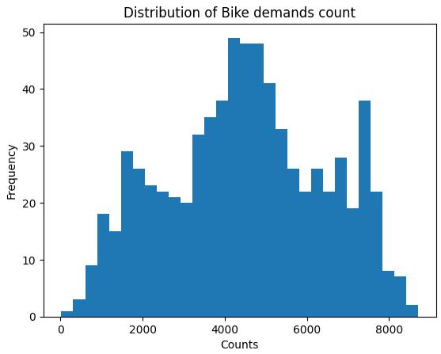

# Bike Sharing & Rental Demand Prediction

### This project focuses on data analysis, automated machine learning using AutoGluon, and future demand predictions via Time Series Analysis. The core of the project is AutoGluon, which automates various machine learning tasks such as data preprocessing, model training, and outcome prediction.

---

## Table of Contents

1. [Introduction](#introduction)
2. [Requirements](#requirements)
3. [Data Analysis](#data-analysis)
4. [Machine Learning](#machine-learning)
5. [Future Predictions](#future-predictions)
6. [Clone the Project](#clone-the-project)

---

## Introduction

This project aims to predict bike rental demand using AutoGluon, an automated machine learning library that streamlines the entire process, from data preprocessing to model selection and evaluation. The dataset used for this analysis is the **Bike Sharing Demand** dataset, which is publicly available for download.

- **Dataset:** [Bike Sharing Demand Dataset](https://archive.ics.uci.edu/dataset/275/bike+sharing+dataset)
- **Problem Statement:** Perform data analysis, automatically train machine learning models, and predict future bike rental demand.
- **Tasks Performed:**
  - Basic data analysis
  - Machine learning model training
  - Future time series forecasting

---

## Requirements

This project relies on several libraries for its implementation:
- **Pandas** for data manipulation and analysis
- **Matplotlib** and **Seaborn** for data visualization
- **AutoGluon** for automating machine learning workflows
- **Prophet** by Facebook (now Meta) for time series forecasting

To install all dependencies, use the following command:

```bash
pip install -r requirements.txt
````

---

## Data Analysis

Basic data analysis was performed to understand the dataset. Below are some of the key analyses conducted. For a more detailed breakdown, please refer to the project notebook.

1. **Bike Demand Distribution**: This analysis visualizes the distribution of bike demand.
   

2. **Rental Bike Trend**: This visual shows the bike rental trend on a monthly and yearly basis for two years.
   

---

## Machine Learning

AutoGluon was employed to handle the machine learning pipeline, which includes data preprocessing, model training, and selection. The best-performing model was a **WeightedEnsemble\_L2** with the following metrics:

* **Root Mean Squared Error (RMSE) for test data:** -44.41
* **Root Mean Squared Error (RMSE) for validation set:** -68.740791	

The leaderboard image below displays the performance of different models tested during the process.


---

## Future Predictions

Future bike rental demand was predicted using time series analysis with **Prophet**, which provides a one-month forecast. The following visualization shows the predicted future demand trend.


---

## Clone the Project

To clone this project and run it locally, use the following Git command:

```bash
git clone https://github.com/UmerSalimKhan/Bike-Sharing-Demand-Analysis-ML.git
```
